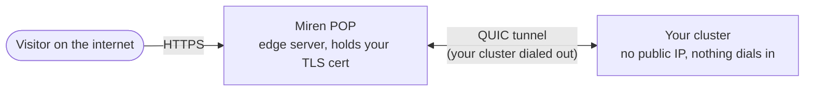

# Miren Anywhere

Say your cluster runs on a home network, a laptop, or a locked-down VPC. It has no public IP, and you'd rather not punch holes in your router, pay for a static address, or wire up dynamic DNS just to put an app online. So how does the internet reach the apps you deploy?

That's what Miren Anywhere does. Your apps go public, Miren Cloud takes the inbound traffic at the edge, and your cluster never has to accept a single inbound connection. It reaches out to Miren Cloud, and traffic flows back down that path.

## How it reaches your apps

Exposing a private server the usual way means changing your network, and Miren Anywhere skips all of it. The only thing your cluster needs is the ability to make outbound connections, which almost every network already allows.

It works through a **POP** (Point of Presence): a Miren Cloud edge server that lives on the public internet, terminates TLS for your hostnames, and forwards requests to your cluster. Your cluster opens the connection *out* to the POP, so from your firewall's point of view nothing is listening and nothing is dialing in.



:::info[Is my traffic encrypted?]
Yes, on every hop across the internet. Your visitors reach the POP over HTTPS, and the POP forwards their requests to your cluster over an encrypted QUIC (HTTP/3) connection, so nothing travels the public internet in the clear.

It isn't end-to-end, though. Like a CDN, the POP terminates TLS at its edge to route your traffic, so Miren Cloud decrypts each request in memory before passing it down the tunnel to you.
:::

## When Anywhere carries your traffic

For setups that clearly need it, Miren turns Anywhere on for you. A containerized install (Docker or Podman) usually can't accept inbound traffic from the internet, so Miren routes its apps through the POP network automatically when the cluster has no reachable public address.

Other installs start with Anywhere off. That's a deliberately cautious default: a cluster that's already reachable is working fine, and Miren would rather leave it alone than reroute it through the POP by mistake. When you want Anywhere on one of these clusters, you turn it on yourself.

You control this per cluster from the **Miren Anywhere** setting on the cluster's page in [Miren Cloud](/miren-cloud/overview):

- **Default** — what a cluster starts on: Anywhere is on for containerized installs (Docker or Podman), which effectively can't accept inbound traffic, and off everywhere else.
- **Auto** — route through the POP network whenever the cluster has no reachable public address, whether or not it's containerized. A cluster that can be reached directly keeps serving its apps itself.
- **Always** — route through the POP network no matter what, even if the cluster has a public IP.
- **Never** — leave Anywhere off. Apps are reachable only where the cluster's own network reaches.

When a cluster routes via POP, Miren Cloud points its hostnames at the POP fleet; when it routes direct, those names point at the cluster's own address.

:::warning[Still evolving]
Miren Anywhere is under active development, and the automatic default is intentionally conservative while we harden the checks that decide when a cluster needs the POP network. Expect the defaults to open up, and the settings to change, as it matures.
:::

## Under the hood

You don't need this section to use Miren Anywhere. It's here for the curious.

When your cluster is registered with Miren Cloud, the miren server holds a long-lived WebSocket open to `miren.cloud`. That connection is how Cloud reaches back to a cluster that can't be dialed directly.

When a request for one of your hostnames arrives at a POP and the cluster isn't connected to that POP yet, three things happen in quick succession. The POP asks Cloud to wake the cluster, briefly telling the visitor to retry. Cloud relays the request down the cluster's connection along with a one-time token. The cluster then dials the POP directly over QUIC (HTTP/3), presents the token, and the POP registers the link. From then on, requests for your hostnames terminate at the POP and get forwarded to your cluster over the encrypted tunnel.

The token handshake is what makes this safe behind carrier-grade NAT, where many clusters can share one public IP: the POP matches the connection to the right cluster by its token rather than its address.

## Limitations for now

Miren Anywhere is young, and there are edges it doesn't cover yet. Here's what to expect today.

**It covers your cluster's Miren-managed hostnames.** Traffic routes through the POP network for your cluster's `cluster-xyz.miren.systems` address and any [Miren Cloud subdomains](/miren-cloud/subdomains) you've claimed. Bringing your own custom domain through Miren Anywhere isn't supported yet. For now, a custom domain needs a cluster that's directly reachable on the public internet.

**It carries app traffic, not deploys.** Miren Anywhere routes the HTTP and HTTPS your visitors load, on ports 80 and 443. It doesn't yet carry the control plane, so `miren deploy`, `miren logs`, and other CLI commands still need a direct network path to the cluster they're talking to. In practice that means a cluster with no public address can serve its apps to the whole internet through the POP network while you deploy to it from the same LAN. Carrying that traffic over Miren Anywhere too is on the roadmap.

:::info[Reading the Connectivity panel]
This split is why a cluster can show "Not reachable" for deploys yet still show its apps as available. See [Cluster Connectivity](/miren-cloud/connectivity) for how the deploy path and the app path are checked separately.
:::

## Verify the connection

The clearest signal is in the server logs. Once the server is running, look for the Miren Anywhere connector reaching Cloud:

```text
component=anywhere ... connected to cloud
```

From [Miren Cloud](/miren-cloud/overview), the [Connectivity](/miren-cloud/connectivity) panel on your cluster's page reflects the same thing: when the live link is up, the cluster reads **Connected**, as opposed to merely **Online** (which only means it's still checking in).

## When something's wrong

:::warning[Your apps aren't reachable at all]
First, check that Miren Anywhere is actually on for the cluster. A cluster set to **Never**, or a non-containerized install still on its default, never routes through the POP network, so its hostnames aren't pointed there and nothing reaches them from outside, even though the connection to Cloud is perfectly healthy. Set the mode to **Auto** or **Always** on the cluster's page in Miren Cloud. See [when Anywhere carries your traffic](#when-anywhere-carries-your-traffic).
:::

:::note[A request briefly returns "retry shortly"]
The first request to a cluster that isn't connected to that POP yet gets a short `503 Cluster connecting, retry shortly` while the POP wakes your cluster to dial in. It clears on a retry within a few seconds. The connection also re-establishes itself automatically if it ever drops, so you don't need to restart the server to recover.
:::

:::warning[The connection never forms]
Miren Anywhere needs outbound connectivity from your cluster on two paths: a WebSocket to Miren Cloud for the control channel (standard HTTPS, TCP 443), and a QUIC connection to the Miren POP it's told to dial (UDP 8443). Strict egress filtering, or a network that blocks outbound UDP, will keep the tunnel from forming. Your server logs under `component=anywhere` show the POP address it's reaching for; a repeating `websocket disconnected, reconnecting` line means it's trying and failing, while `connected to cloud` means it's up.
:::

## Next steps

- [Subdomains](/miren-cloud/subdomains) — Claim a hostname that routes through Miren Anywhere
- [Cluster Connectivity](/miren-cloud/connectivity) — Read the three connectivity checks and what each one means
- [Miren Cloud Overview](/miren-cloud/overview) — Cluster registration and login
